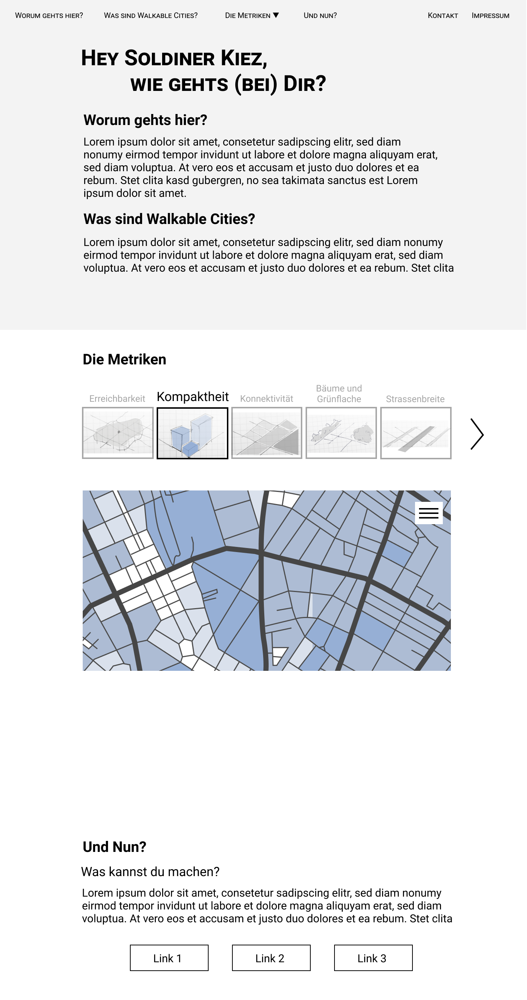
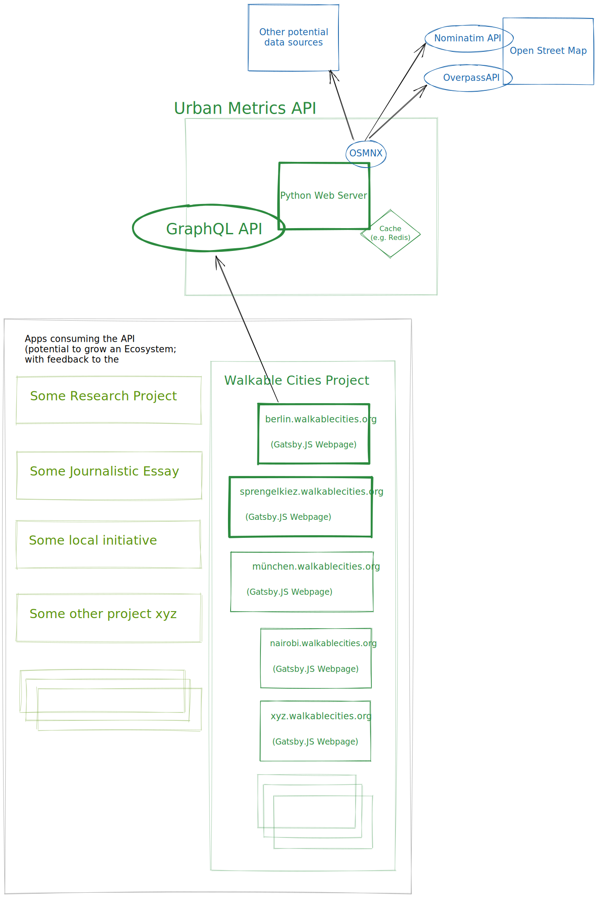

# Walkable Cities 
## The goal 
### Users Stories (WIP)
|As|I want to|So I |
|------|-------|-------|
|resident of a neglected area|find good data about my neighbourhood which I can use with the officials|make my Kiez more livable|
|Quartiersmanagement Soldiner Str|have an easy, sharable and trustworthy presentation of how good the infrastructure for kids is currently in the Kiez|can include the residents into an open, informed and efficient discussion and ideation how to improve the situation for kids|
|a political party|analyse the actual situation of an area in terms of walkability (health, recreation, kids friendly, walkable etc)|can understand the needs better|
|a journalist who writes about problems in a city/area regarding sustainability and social issues, but who is not an expert in urbanism or GIS|I want to easily get an idea about things like reachability, greening and how good needs (like coffees, playgroiunds, shops etc) of an area (or several areas to compare) I want to write about|So I can get a good starting-point overview for my research and have easy-to-understand and trustworthy third-party sources I can refer to iny my article|
|As urban gardening project who is danger of getting canceld because the local authorities want to build a school for kids with special needs on the ground|I want to have access to an objective and trustworthy source about the level of greenings, social and recreation areas in the Kiez and about other potential places for the school|So I can undertand the actual situation and options better and have a better argument, both for discussions and informations of the residents as well for discussing with the authorities|

### UI Prototype (WIP)
[Figma link](https://www.figma.com/file/A6vFuZbN5BucUtFICJDRpG/new-urbanism-ideas?node-id=61%3A4)

## Technical Design (WIP)

